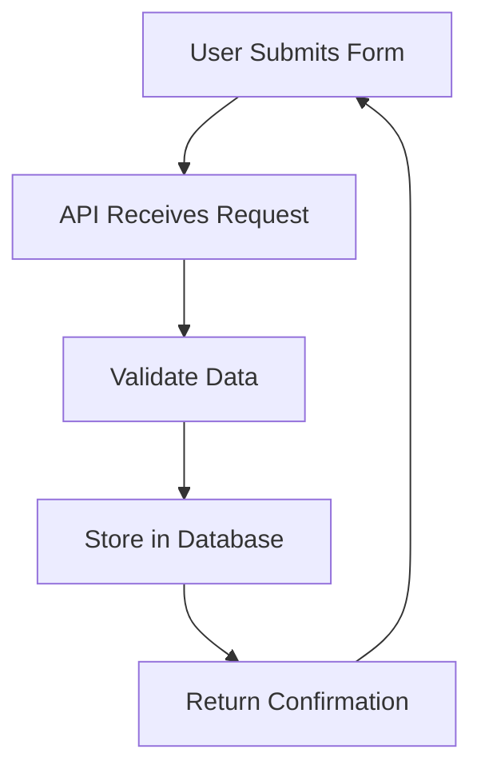
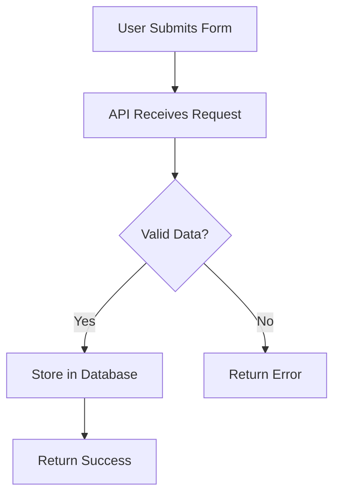
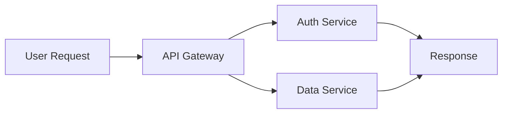

# Data Flow Diagram

## When to Use This

Use data flow diagrams to visualize how data moves through a system. Perfect for documenting APIs, understanding system architecture, or explaining data pipelines to stakeholders.

## Example Scenario

This diagram shows a typical web application data flow: a user submits a form, the API validates the data, stores it in a database, and sends a confirmation back to the user.

## Diagram



**Code:**
````markdown

````

## Key Elements Explained

- **User Input**: Starting point of the data flow
- **API Layer**: Handles validation and business logic
- **Database**: Persistent storage layer
- **Response**: Confirmation sent back to user

## Tips & Best Practices

- Keep flows left-to-right or top-to-bottom for readability
- Use clear, specific labels (avoid generic terms like "Process 1")
- Limit to 7 nodes or fewer for clarity
- Add colors/styling sparingly - clarity over aesthetics

## When to Use This Pattern

- Documenting API endpoints
- Explaining system architecture to non-technical stakeholders
- Onboarding new team members
- Technical design documents

## Customization Ideas

**Add Decision Points:**


**Show Parallel Processing:**

