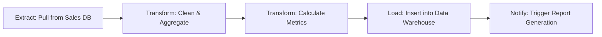
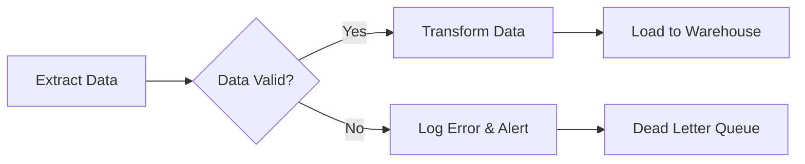
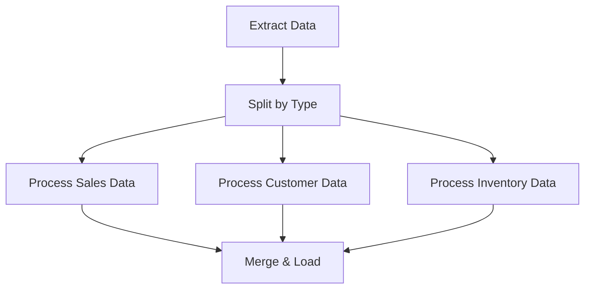
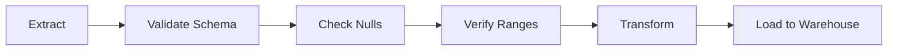

# ETL Pipeline Diagram

## When to Use This

ETL (Extract, Transform, Load) diagrams visualize data processing workflows. Essential for data engineering documentation, pipeline design, and communicating data architecture.

## Example Scenario

This diagram shows a daily sales report generation pipeline: extract sales data from the database, clean and aggregate it, load into a data warehouse, and trigger automated reporting.

## Diagram

## Key Elements Explained

- **Extract**: Source data retrieval from operational database
- **Transform**: Data cleaning, aggregation, and business logic
- **Load**: Moving processed data to analytics storage
- **Trigger**: Automated downstream processes

## Tips & Best Practices

- Clearly label data sources and destinations
- Show transformation steps explicitly (don't hide complexity)
- Use subgraphs if you have multiple parallel pipelines
- Include frequency/schedule in documentation (daily, hourly, real-time)

## Common Variations

**With Error Handling:**

**Parallel Processing:**

**With Data Quality Checks:**

