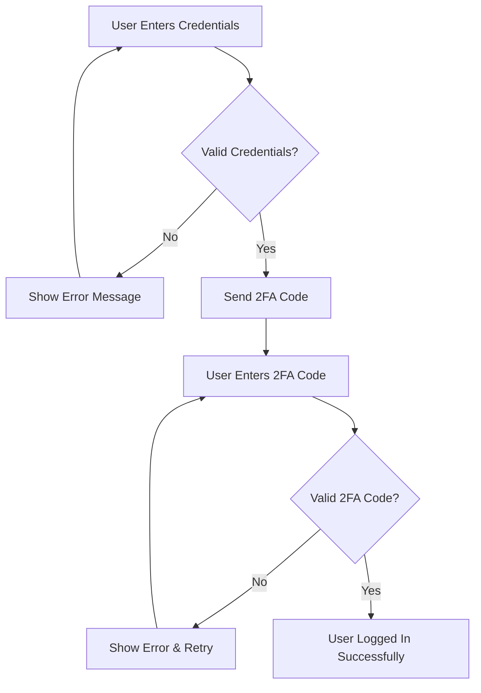
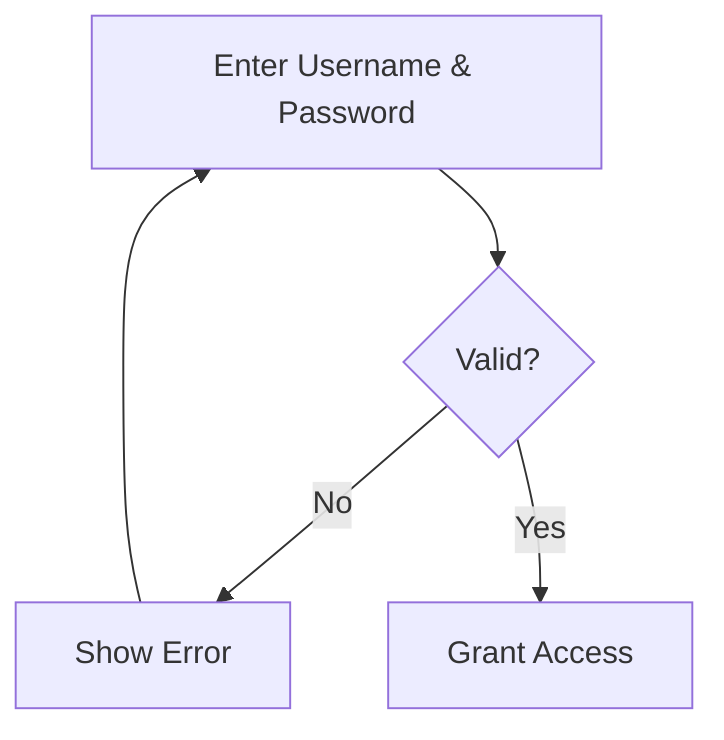
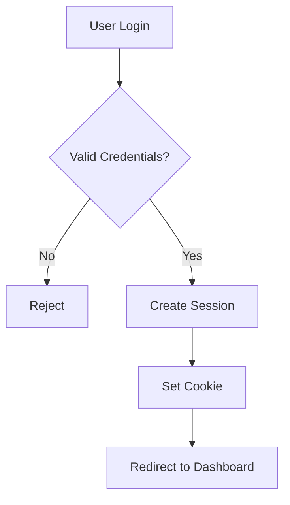
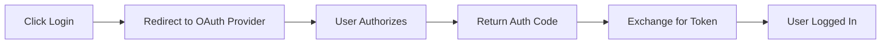

# User Login Process Flow

## When to Use This

Process flow diagrams with decision points are perfect for documenting authentication flows, user journeys, or any process with conditional logic.

## Example Scenario

This diagram shows a standard user login process with two-factor authentication, including decision points for validation and 2FA verification.

## Diagram



**Code:**
````markdown

````

## Key Elements Explained

- **Decision Points**: Where the flow branches based on conditions
- **Validation Steps**: Security checks before granting access
- **Error Paths**: What happens when validation fails
- **Success State**: Final outcome of the process

## Tips & Best Practices

- Limit decision points to 1-2 per diagram for clarity
- Always show both success and failure paths
- Use descriptive labels on decision branches (Yes/No, Valid/Invalid)
- Keep error handling visible but don't let it dominate the diagram

## When to Use This Pattern

- Authentication and authorization flows
- User onboarding processes
- Feature access logic
- Form submission workflows

## Customization Ideas

**Simple Login (No 2FA):**


**With Session Management:**


**OAuth Flow:**

