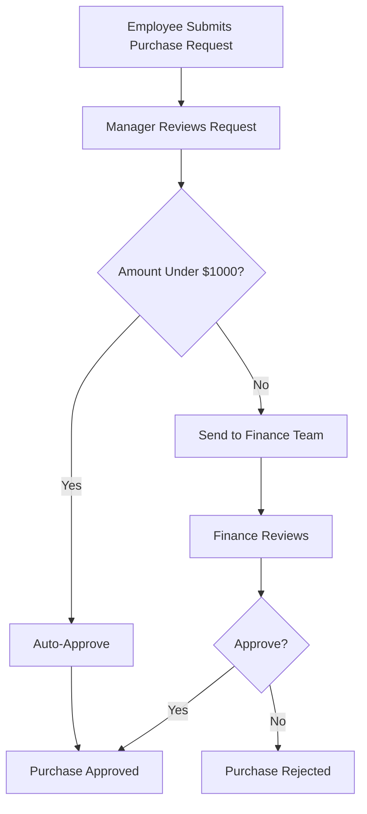
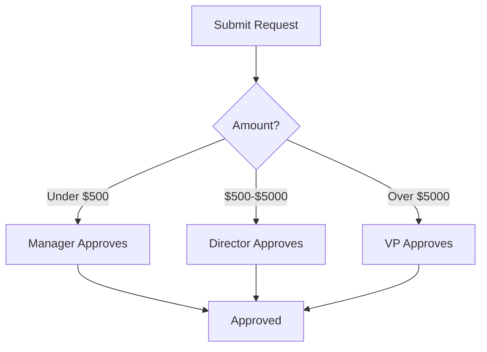
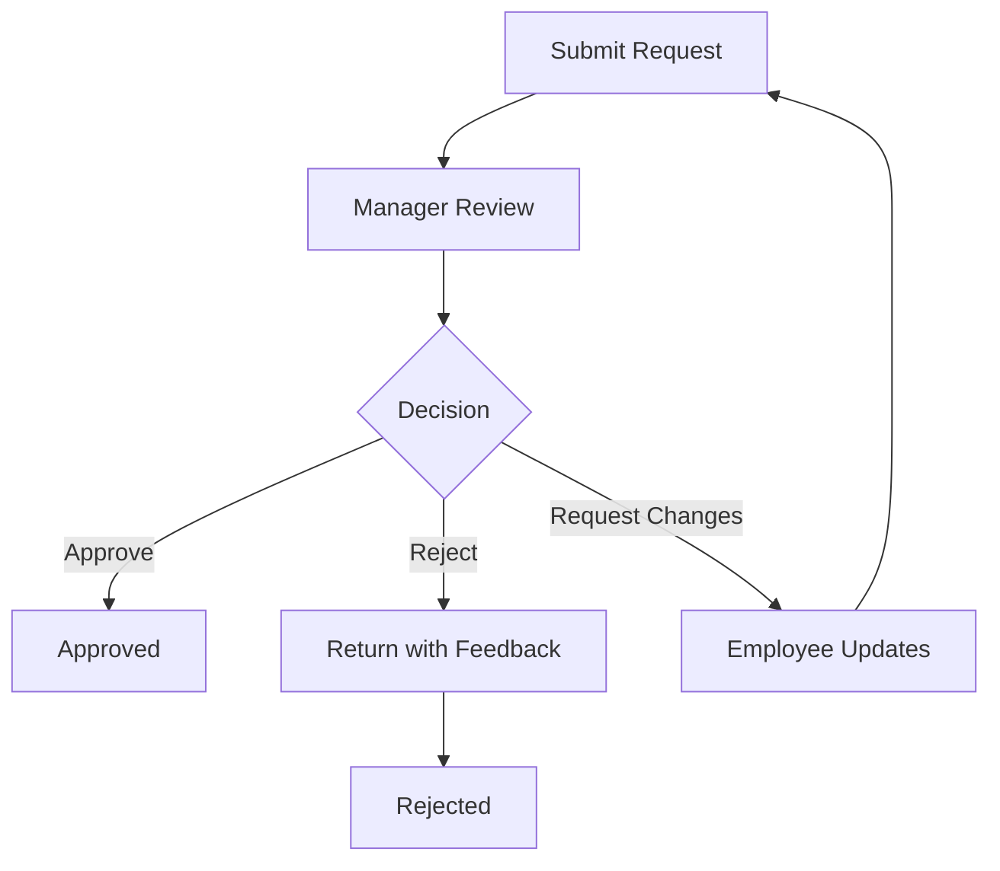
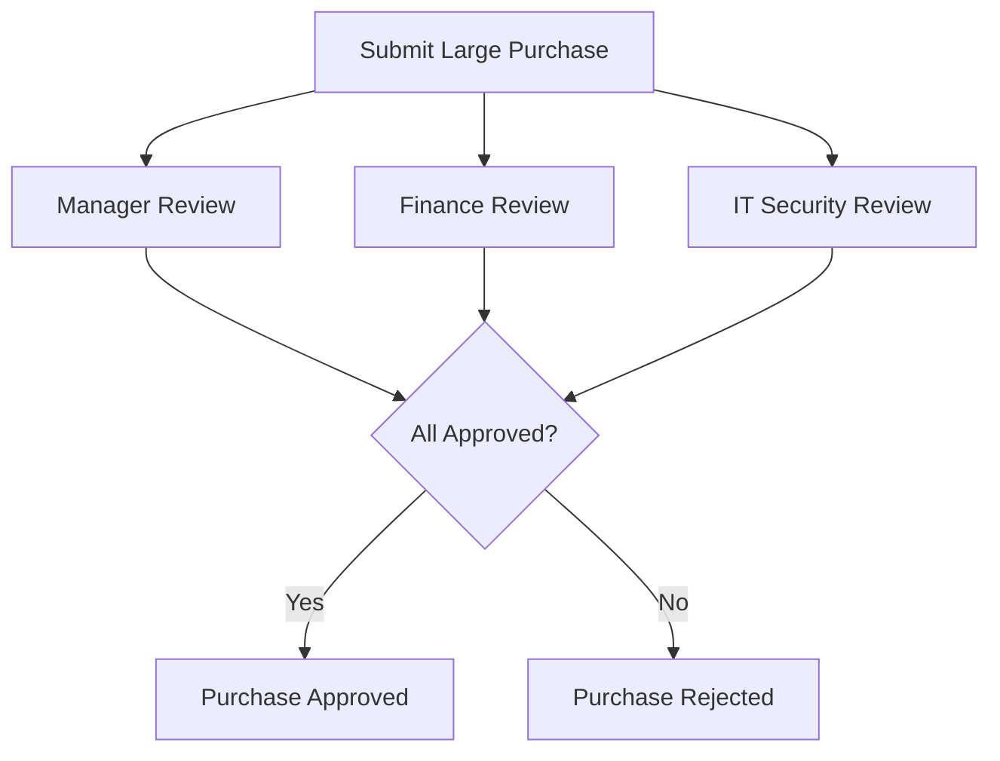

# Business Process Flow - Purchase Approval

## When to Use This

Business process diagrams document operational workflows, approval processes, and standard operating procedures. Perfect for business analysts, operations teams, and process documentation.

## Example Scenario

This diagram shows a purchase request approval workflow with automatic approval for small purchases and manager/finance approval for larger amounts.

## Diagram

## Key Elements Explained

- **Submission**: Starting point initiated by employee
- **Review Stages**: Different approval levels based on amount
- **Decision Logic**: Conditional routing based on purchase value
- **End States**: Clear outcomes (approved or rejected)

## Tips & Best Practices

- Clearly label who is responsible for each step
- Show decision criteria explicitly ($1000 threshold)
- Include both approval and rejection paths
- Consider adding timing/SLA information in actual documentation

## Common Use Cases

- Approval workflows (expense, vacation, hiring)
- Order fulfillment processes
- Customer onboarding workflows
- Incident response procedures

## Customization Ideas

**Multi-Level Approval:**

**With Rejection Feedback Loop:**

**Parallel Approvals:**

