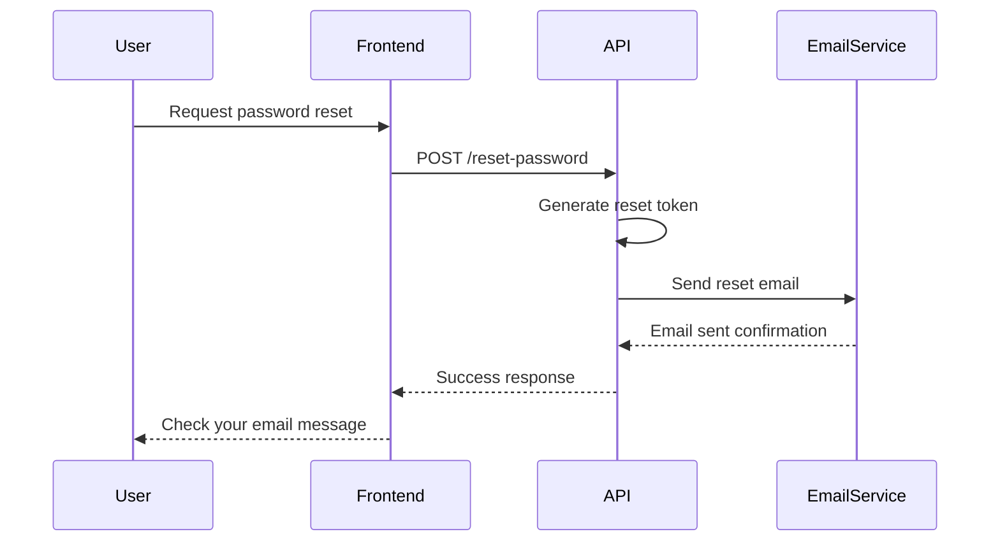
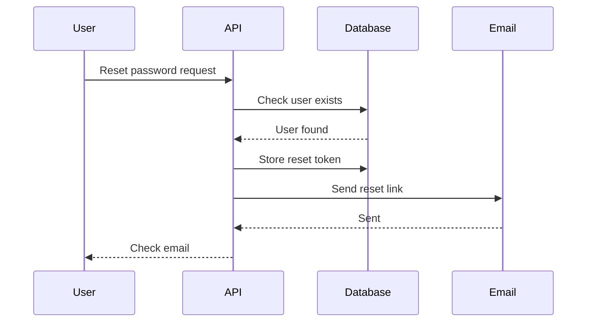
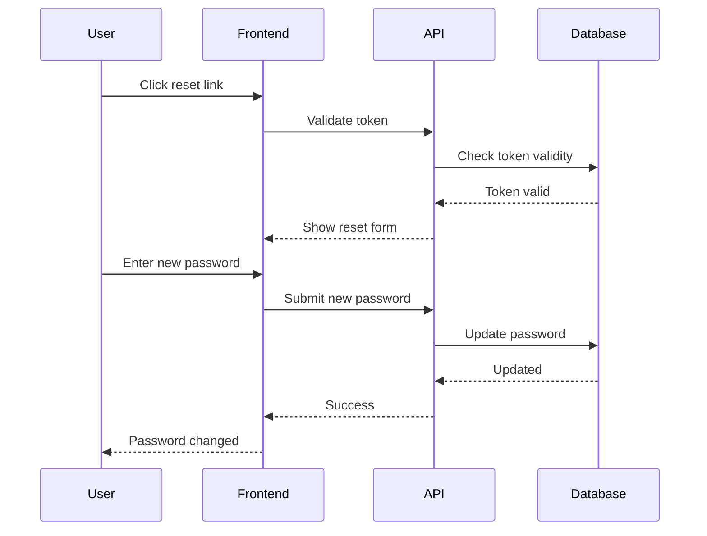
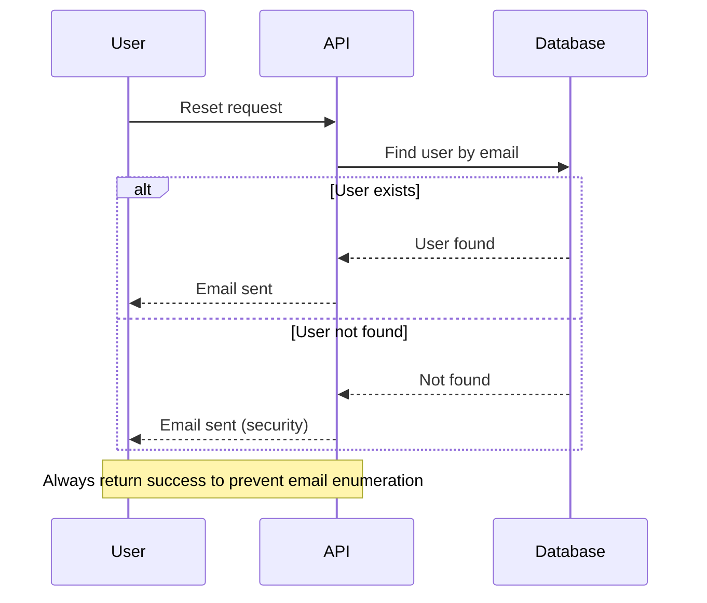

# Sequence Diagram - Password Reset

## When to Use This

Sequence diagrams show interactions between different parts of a system over time. Ideal for documenting API calls, service communication, and system integrations.

## Example Scenario

This diagram shows how different components interact during a password reset: the user interface, backend API, database, and email service.

## Diagram



**Code:**
````markdown

````

## Key Elements Explained

- **Participants**: The actors/systems involved in the interaction
- **Messages**: Communications between participants (arrows)
- **Sequence**: The order of operations from top to bottom
- **Responses**: Return values and confirmations (dashed arrows)

## Tips & Best Practices

- Limit to 3-5 participants for readability
- Show request and response pairs clearly
- Use descriptive message labels
- Keep the sequence linear - avoid too many conditional branches

## When to Use This Pattern

- API documentation
- Microservices communication
- Integration workflows
- Debugging distributed system issues

## Customization Ideas

**With Database Interaction:**


**Complete Reset Flow:**


**With Error Handling:**

