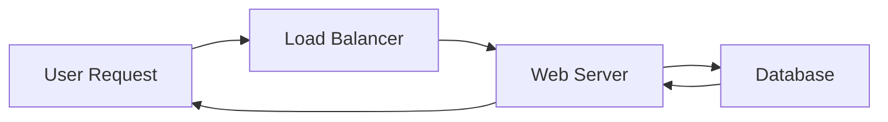
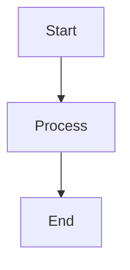

# Mermaid Diagram Patterns

**Ready-to-use Mermaid diagram patterns for documentation, technical design, and business processes.**

## What is Mermaid?

Mermaid is a JavaScript-based diagramming tool that lets you create diagrams using text and code. Instead of using external design tools, you can write your diagrams directly in markdown files that live alongside your code.

**Key Benefits:**
- Version controlled with your code
- Easy to update and maintain
- No external tools needed
- Works in GitHub, GitLab, Notion, and more

## Hero Example

Here's a simple process flow showing how a user request moves through a web application:



This diagram shows the complete journey: request comes in, gets routed through a load balancer, processed by the web server, data is fetched from the database, and the response is sent back to the user.

## Examples

Each example folder contains a complete README with:
- **Real-world scenario** explaining when to use the pattern
- **Live diagram** that renders on GitHub
- **Copy-paste code** showing the exact Mermaid syntax
- **Customization examples** for different use cases
- **Tips and best practices** for creating effective diagrams

| Diagram Type | Use Case | Best For |
|--------------|----------|----------|
| [Data Flow](./01-data-flow/) | System data movement | Software/Data Engineers |
| [ETL Pipeline](./02-etl-pipeline/) | Data processing workflows | Data Engineers, Analytics |
| [User Login Flow](./03-user-login-flow/) | Authentication processes | Software Engineers, PMs |
| [Purchase Approval](./04-purchase-approval/) | Business workflows | Business Analysts, Operations |
| [Password Reset](./05-password-reset-sequence/) | System interactions | Software Engineers, Technical PMs |

## Getting Started

### Using Mermaid in Markdown

Simply create a code block with the `mermaid` language tag:

````markdown

````

**Pro Tip:** Use [Mermaid Live Editor](https://mermaid.live) to experiment with your diagrams before adding them to your documentation. It provides real-time preview and syntax validation!

### Where is Mermaid Supported?

- **GitHub** - Renders automatically in README files and issues
- **GitLab** - Native support in markdown files
- **Notion** - Use `/code` block and select Mermaid
- **VS Code** - Install Mermaid preview extensions
- **Confluence** - Via Mermaid plugins
- **Docusaurus, MkDocs, and other documentation tools**

### Learn More

For complete syntax and advanced features, visit the [official Mermaid documentation](https://mermaid.js.org/).

## Contributing

Found these examples helpful? Feel free to suggest improvements or additional examples via issues or pull requests. Let's make documentation easier for everyone!

## License

MIT License - feel free to use these patterns in your projects.
